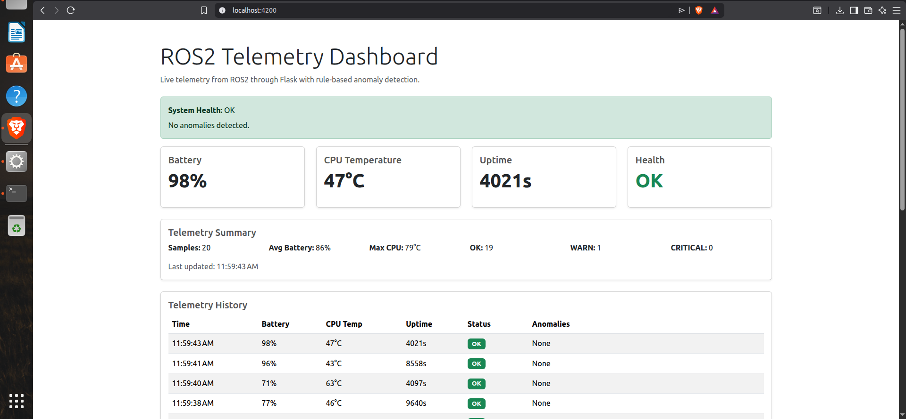

# ROS2 Robot Health Monitoring Dashboard

A containerized ROS2 telemetry monitoring system that publishes simulated robot health data, bridges ROS2 telemetry to a Flask HTTP API, and displays live telemetry in an Angular dashboard. 

This project demonstrates a distributed robotics software architecture using ROS2 Humble, Python, Flask, Angular, RxJS, Bootstrap, and Docker Compose. Implemented ROS2 publisher/subscriber nodes, a Flask bridge API, live dashboard telemetry updates, telemetry history tracking, and rule-based anomaly detection for robot health monitoring.





## Project Overview

This system simulates a robotics telemetry pipeline:

```text
ROS2 Telemetry Publisher
        |
        v
ROS2 Topic: /telemetry
        |
        v
ROS2 Telemetry Bridge + Flask API
        |
        v
Angular Telemetry Dashboard
```

The backend publishes telemetry such as battery level, CPU temperature, and uptime through a ROS2 topic. A bridge node subscribes to that topic and exposes the latest telemetry through a Flask API. The Angular frontend polls the API and displays the live system state in the browser.

---

## Why This Project Exists

Robotics systems often rely on telemetry to monitor robot health, detect failures, and support debugging. This project provides a small but complete example of how telemetry can move through a robotics software stack:

* ROS2 node publishes telemetry.
* ROS2 topic transports telemetry.
* Python bridge subscribes to ROS2 messages.
* Flask API exposes telemetry to non-ROS clients.
* Angular dashboard displays live robot state.
* Docker Compose runs the full system reproducibly.

This project is intended as a foundation for more advanced robotics monitoring features such as anomaly detection, predictive maintenance, and AI-assisted health summaries.

---

## Tech Stack

### Robotics / Backend

* ROS2 Humble
* Python 3
* `rclpy`
* `std_msgs`
* Flask
* Flask-CORS

### Frontend

* Angular
* TypeScript
* RxJS
* Bootstrap

### DevOps / Environment

* Docker
* Docker Compose
* Git / GitHub

---

## Repository Structure

```text
ros2-telemetry-system/
├── Dockerfile
├── docker-compose.yml
├── README.md
├── LICENSE
├── .gitignore
├── ros2_ws/
│   └── src/
│       └── telemetry_system/
│           ├── package.xml
│           ├── setup.py
│           ├── setup.cfg
│           ├── resource/
│           │   └── telemetry_system
│           └── telemetry_system/
│               ├── __init__.py
│               ├── telemetry_publisher.py
│               ├── telemetry_listener.py
│               └── telemetry_bridge.py
└── telemetry-dashboard/
    ├── angular.json
    ├── package.json
    ├── package-lock.json
    └── src/
        └── app/
            ├── app.config.ts
            ├── app.html
            ├── app.routes.ts
            ├── app.ts
            └── telemetry/
                ├── telemetry.ts
                ├── telemetry.html
                └── telemetry.css
```

---

## Architecture

```text
+-----------------------------+
| ROS2 Telemetry Publisher    |
| telemetry_publisher.py      |
| Publishes JSON telemetry    |
+-------------+---------------+
              |
              v
+-----------------------------+
| ROS2 Topic                  |
| /telemetry                  |
| std_msgs/String             |
+-------------+---------------+
              |
              v
+-----------------------------+
| ROS2 Telemetry Bridge       |
| telemetry_bridge.py         |
| Subscribes to /telemetry    |
| Runs Flask API              |
+-------------+---------------+
              |
              v
+-----------------------------+
| Flask API                   |
| GET /telemetry              |
| http://localhost:5000       |
+-------------+---------------+
              |
              v
+-----------------------------+
| Angular Dashboard           |
| http://localhost:4200       |
| Displays live telemetry     |
+-----------------------------+
```

---

## Telemetry Data

The telemetry publisher currently simulates robot health data:

```json
{
  "battery": 98,
  "cpu_temp": 73,
  "uptime": 5332
}
```

### Fields

| Field      | Description                              |
| ---------- | ---------------------------------------- |
| `battery`  | Simulated battery percentage             |
| `cpu_temp` | Simulated CPU temperature in Celsius     |
| `uptime`   | Simulated robot/system uptime in seconds |

---

## ROS2 Nodes

### `telemetry_publisher`

Publishes simulated telemetry data to the ROS2 topic:

```text
/telemetry
```

The message type is:

```text
std_msgs/String
```

The message payload is JSON-formatted telemetry.

---

### `telemetry_listener`

Subscribes to the telemetry topic and prints incoming telemetry messages to the ROS2 console.

This node is useful for validating that ROS2 messages are being published and received correctly.

---

### `telemetry_bridge`

Subscribes to the ROS2 telemetry topic and exposes the latest message through a Flask API.

The bridge allows non-ROS applications, such as the Angular dashboard, to consume ROS2 telemetry over HTTP.

---

## API Endpoint

### Get Latest Telemetry

```http
GET /telemetry
```

URL:

```text
http://localhost:5000/telemetry
```

Example response:

```json
{
  "battery": 98,
  "cpu_temp": 73,
  "uptime": 5332
}
```

---

## Prerequisites

Install:

* Docker
* Docker Compose
* Git

You do not need to install ROS2 or Angular directly on your host machine. Both run through Docker containers.

---

## Running the Project

From the root of the repository:

```bash
docker compose up --build
```

This starts:

* ROS2 backend container
* Telemetry publisher
* Telemetry bridge
* Flask API
* Angular dashboard container

---

## Accessing the Application

### Angular Dashboard

Open:

```text
http://localhost:4200
```

### Flask Telemetry API

Open:

```text
http://localhost:5000/telemetry
```

Or test with curl:

```bash
curl http://localhost:5000/telemetry
```

Expected response:

```json
{
  "battery": 98,
  "cpu_temp": 73,
  "uptime": 5332
}
```

Values will vary because the telemetry is simulated.

---

## Verifying ROS2 Telemetry

To inspect backend logs:

```bash
docker compose logs -f ros2_dev
```

You should see output from the telemetry publisher and bridge, similar to:

```text
Publishing telemetry: {'battery': 98, 'cpu_temp': 73, 'uptime': 5332}
Bridge Received: {"battery":98,"cpu_temp":73,"uptime":5332}
```

To inspect Angular logs:

```bash
docker compose logs -f telemetry_dashboard
```

---

## Development Workflow

### Start the full system

```bash
docker compose up --build
```

### Stop the system

```bash
docker compose down
```

### Rebuild after Dockerfile changes

```bash
docker compose up --build
```

### Check running containers

```bash
docker ps
```

---

## Angular Telemetry Dashboard

The Angular dashboard consumes telemetry from the Flask API and updates the page with live telemetry values.

The frontend uses RxJS to poll the telemetry API and Angular’s `async` pipe to update the view when new telemetry is received.

Example stream concept:

```text
RxJS timer
    |
    v
HTTP GET /telemetry
    |
    v
Telemetry Observable
    |
    v
Angular template updates
```

---

## Screenshots

Add screenshots to:

```text
docs/screenshots/
```

Recommended screenshots:

```text
docs/screenshots/dashboard-running.png
docs/screenshots/telemetry-api-response.png
docs/screenshots/ros2-container-log.png
```

Then include them here:

### Dashboard

```md

```

### API Response

```md

```

---

## Generated Files

The following ROS2 workspace directories are generated by `colcon build` and should not be committed:

```text
ros2_ws/build/
ros2_ws/install/
ros2_ws/log/
```

The source of truth for the ROS2 package is:

```text
ros2_ws/src/
```

The repository `.gitignore` should include:

```gitignore
ros2_ws/build/
ros2_ws/install/
ros2_ws/log/
telemetry-dashboard/node_modules/
telemetry-dashboard/dist/
.angular/
__pycache__/
*.pyc
.vscode/
```

---

## Current Status

Implemented:

* ROS2 telemetry publisher
* ROS2 telemetry listener
* ROS2 telemetry bridge
* Flask telemetry API
* Angular dashboard
* Docker Compose environment
* Live telemetry display
* CORS-enabled frontend/backend communication

---

## Future Improvements

### Dashboard Improvements

* Add telemetry history.
* Add line charts for battery and CPU temperature.
* Add connection status indicator.
* Add last-updated timestamp.
* Add warning colors for abnormal telemetry.
* Add responsive dashboard layout.

### Robotics Improvements

* Replace simulated telemetry with real robot or sensor data.
* Add additional telemetry fields such as velocity, motor current, pose, and error codes.
* Support multiple robot telemetry streams.
* Add ROS2 launch files.
* Add ROS2 parameters for configurable telemetry rates.

### AI / Machine Learning Improvements

The natural AI direction for this project is robot health monitoring.

Potential AI features:

* Detect unusual CPU temperature patterns.
* Detect abnormal battery drain.
* Detect telemetry dropouts.
* Predict low-battery events.
* Predict overheating risk.
* Generate AI-assisted health summaries.

Example future output:

```text
System Health: Warning
Reason: CPU temperature is higher than expected for the recent operating pattern.
Suggested Action: Reduce workload or inspect cooling.
```

A possible long-term project direction:

```text
ROS2 Intelligent Telemetry Monitor
```

or:

```text
AI-Assisted ROS2 Robot Health Dashboard
```

---

## Portfolio Value

This project demonstrates:

* ROS2 node development
* ROS2 topic-based communication
* Python backend development
* Flask API integration
* Angular frontend development
* RxJS-based live data handling
* Docker Compose orchestration
* Full-stack robotics system design
* Debugging across containers, ROS2, HTTP, and browser clients

This makes the project useful as a robotics software engineering portfolio piece.

---

## License

This project is licensed under the terms of the repository license.

---

## Author

David Michael
GitHub: [s2623J](https://github.com/s2623J)
